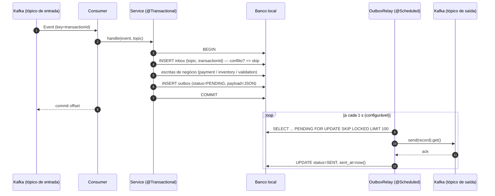

# SDD — Transactional Outbox Pattern

| Campo        | Valor                                                     |
|--------------|-----------------------------------------------------------|
| Status       | Proposta (rascunho para revisão)                          |
| Autor        | Bruno Murakami                                            |
| Data         | 2026-10-07                                                |
| Escopo       | `order-service`, `product-validation-service`, `payment-service`, `inventory-service`, `orchestrator-service` |
| Relacionados | `content/Arquitetura Proposta.png`, `content/Mapeamento dos Tópicos.xlsx` |

---

## 1. Contexto

O projeto implementa uma **Saga orquestrada** sobre Kafka. O `order-service` inicia a saga
publicando em `start-saga`; o `orchestrator-service` roteia o evento (tabela `SagaHandler`) para
`product-validation-service` → `payment-service` → `inventory-service`, e cada serviço devolve o
resultado no tópico `orchestrator`. Ao final, o orquestrador publica em `notify-ending`, consumido
pelo `order-service`.

Todos os serviços que possuem banco de dados seguem o mesmo padrão:

```java
// payment-service/.../PaymentService.java
public void realizePayment(Event event) {
    try {
        checkCurrentPayment(event);
        createPendingPayment(event);      // escreve no Postgres
        ...
        changePaymentToSuccess(payment);  // escreve no Postgres
        handleSuccess(event);
    } catch (Exception ex) {
        handleFailCurrentNotExecuted(event, ex.getMessage());
    }
    producer.sendEvent(jsonUtil.toJson(event)); // escreve no Kafka
}
```

```java
// order-service/.../OrderService.java
orderRepository.save(order);                                   // MongoDB
producer.sendEvent(jsonUtil.toJson(createPayload(order)));     // MongoDB + Kafka
```

## 2. Problema

### 2.1 Dual write

Cada operação escreve em **dois sistemas sem transação comum** (banco local + Kafka). Não existe
nenhum `@Transactional` no código. Cenários de falha concretos:

| # | Cenário | Consequência |
|---|---------|--------------|
| P1 | Banco confirma, processo cai antes do `send` | Estado local alterado e **mensagem nunca publicada** → saga fica travada para sempre (ex.: pagamento `SUCCESS` sem avançar para o inventário). |
| P2 | `send` falha (broker indisponível) | Os producers fazem `kafkaProducer.send(...)` **assíncrono, sem `.get()` e sem callback**; o erro é engolido pelo `catch`/log. O offset do consumidor é commitado mesmo assim → **mensagem perdida silenciosamente**. |
| P3 | Mensagem publicada, banco falha depois (ex.: `inventory` salva item 1, falha no item 2) | Hoje o `catch(Exception)` mascara inclusive erros de infraestrutura e publica o evento mesmo com o estado parcial. |
| P4 | `order-service`: `Order` salva, `Event` salvo, Kafka falha | Pedido existe e é retornado ao cliente com `transactionId`, mas a saga nunca começa. |

### 2.2 Duplicidade (efeito colateral que o Outbox torna mais frequente)

Os serviços usam `existsByOrderIdAndTransactionId(...)` como guarda. Se a **mesma mensagem for
entregue duas vezes** (rebalance, retry, ou o próprio relay do outbox reenviando), a guarda lança
`ValidationException`, que cai no `catch` e marca o evento como `ROLLBACK_PENDING` →
**o orquestrador dispara rollback de uma etapa que tinha dado certo**.

Como o Outbox garante entrega **at-least-once**, este bug precisa ser corrigido no mesmo pacote de
trabalho (Inbox / consumidor idempotente — seção 6).

## 3. Objetivos e não-objetivos

### Objetivos

- **G1** — Atomicidade entre a mudança de estado local e a intenção de publicar: ou ambos são
  persistidos, ou nenhum.
- **G2** — Garantia de entrega *at-least-once* de todo evento persistido, mesmo com o broker
  indisponível por tempo arbitrário.
- **G3** — Processamento idempotente nos consumidores (efeito *exactly-once* de negócio).
- **G4** — Preservar a ordem por saga (`transactionId`).
- **G5** — Sem mudanças no contrato JSON dos eventos nem nos endpoints REST.
- **G6** — Observabilidade do backlog do outbox (pendentes, idade da mensagem mais antiga, falhas).

### Não-objetivos

- Exactly-once de ponta a ponta via Kafka Transactions em todos os serviços.
- Substituir a saga orquestrada por coreografia.
- Introduzir Debezium/Kafka Connect nesta fase (avaliado como evolução — ADR-01).
- Corrigir regras de negócio da saga (cálculo de valores, estoque etc.).

## 4. Requisitos

### Funcionais

| ID | Requisito |
|----|-----------|
| RF-01 | Toda publicação Kafka feita por `order`, `product-validation`, `payment` e `inventory` deve passar a ser um `INSERT` na tabela/coleção `outbox`, na **mesma transação** das escritas de negócio. |
| RF-02 | Um *relay* em cada serviço deve ler mensagens pendentes do outbox, publicá-las no tópico de destino e marcá-las como enviadas somente após `ack` do broker. |
| RF-03 | Mensagens com falha devem ser reprocessadas com backoff; após `N` tentativas ficam em `FAILED` para análise manual (não bloqueiam as demais). |
| RF-04 | Cada mensagem publicada deve conter a chave Kafka = `transactionId` e os headers `x-message-id`, `x-transaction-id`, `x-source`. |
| RF-05 | Consumidores devem descartar mensagens já processadas (Inbox) sem gerar `ROLLBACK_PENDING`. |
| RF-06 | Mensagens `SENT` devem ser expurgadas após período de retenção configurável. |

### Não funcionais

| ID | Requisito |
|----|-----------|
| RNF-01 | Intervalo de polling do relay padrão de **1 s**, customizável por serviço via `outbox.relay.poll-interval-ms` / `OUTBOX_POLL_INTERVAL_MS`. Latência adicional p95 entre commit e publicação ≤ intervalo de polling + 500 ms (≈ 1,5 s no padrão). |
| RNF-02 | Suportar múltiplas instâncias do mesmo serviço sem publicação concorrente da mesma linha. |
| RNF-03 | Nenhuma nova peça de infraestrutura obrigatória além de habilitar replica set no MongoDB. |
| RNF-04 | Configuração via `application.yml` com variáveis de ambiente, seguindo o padrão atual. |

## 5. Decisões de arquitetura (ADRs)

### ADR-01 — Relay por *polling* (Polling Publisher) em vez de CDC

| Opção | Prós | Contras |
|-------|------|---------|
| **Polling Publisher** (escolhida) | Só código Spring; sem infra nova; fácil de testar e debugar; funciona igual para Postgres e Mongo. | Latência de polling; carga de queries no banco. |
| CDC com Debezium (Outbox Event Router) | Latência baixa; sem polling; lê WAL/oplog. | Kafka Connect + Debezium + configuração de replicação lógica no Postgres e replica set no Mongo; muito peso para um projeto de estudo. |

**Decisão:** Polling. O schema da tabela `outbox` será compatível com o *Outbox Event Router* do
Debezium (`aggregatetype`, `aggregateid`, `type`, `payload`) para permitir a migração futura sem
alterar quem escreve no outbox.

### ADR-02 — Transações no MongoDB (`order-service`)

Transações multi-documento no MongoDB exigem **replica set**. O `docker-compose.yml` sobe o Mongo
standalone.

| Opção | Descrição |
|-------|-----------|
| **A (escolhida)** | Subir o Mongo como replica set de um nó (`--replSet rs0` + `rs.initiate()`), registrar `MongoTransactionManager` e usar `@Transactional` gravando `order`, `event` e `outbox` na mesma transação. |
| B | Embutir o outbox dentro do documento `order` (escrita atômica de documento único, sem replica set). Relay consulta `order.outbox.status`. Mais simples na infra, porém acopla o outbox ao agregado e complica o `event` que também é salvo. |

**Decisão:** A. É o caminho padrão do Spring Data e mantém o mesmo modelo mental dos serviços
Postgres.

### ADR-03 — `orchestrator-service` não recebe Outbox

O orquestrador é **stateless** (não tem banco). Ele faz *consume → transform → produce*; não
existe "dual write" porque não há estado local para ficar inconsistente. O risco real ali é o P2
(send assíncrono engolindo erro + offset commitado).

**Decisão:**
1. Tornar o envio **síncrono** (`kafkaProducer.send(record).get(timeout)`) e **propagar** a exceção,
   para que o `DefaultErrorHandler` do Spring Kafka não commite o offset e reprocesse a mensagem.
2. Producer idempotente (`enable.idempotence=true`, `acks=all`).
3. O `x-message-id` gerado pelo orquestrador é **determinístico**:
   `UUID.nameUUIDFromBytes(inputMessageId + ":" + targetTopic)`, de modo que um reprocessamento gere
   o mesmo id e o Inbox downstream deduplique.

Evolução opcional: Kafka Transactions (`transactional.id` + `isolation.level=read_committed` nos
consumidores) para exactly-once no orquestrador.

### ADR-04 — Chave de deduplicação do Inbox

Pela tabela `SagaHandler`, **cada tópico de serviço é visitado no máximo uma vez por saga**
(`payment-success` uma vez, `payment-fail` uma vez etc.). Logo a chave natural
`(topic, transactionId)` identifica univocamente a mensagem de negócio, independentemente de ids
técnicos.

**Decisão:** Inbox com PK composta `(topic, transaction_id)`. O header `x-message-id` é gravado
apenas para rastreabilidade.

### ADR-05 — Ordenação e particionamento

Hoje os tópicos têm 1 partição e as mensagens são publicadas **sem chave**. Passaremos a usar
`key = transactionId`. Numa saga orquestrada só existe **uma mensagem em voo por saga** em qualquer
instante, portanto não há necessidade de ordem global — apenas por chave, que o Kafka já garante
dentro da partição. Isso permite aumentar partições e instâncias no futuro sem quebrar a saga.

### ADR-06 — Versionamento de schema com Flyway

Hoje os serviços Postgres usam `ddl-auto: create-drop`: o Hibernate **apaga e recria** todas as
tabelas a cada restart e o seed vem de `import.sql`. Isso contradiz o G2, porque mensagens
`PENDING` no outbox sumiriam num restart.

**Decisão:** adotar Flyway **nesta entrega** em `product-validation-service`, `payment-service` e
`inventory-service`, com `spring.jpa.hibernate.ddl-auto: validate`.

| Migration | Conteúdo |
|-----------|----------|
| `V1__baseline.sql` | Tabelas atuais (`product`, `validation` / `payment` / `inventory`, `order_inventory`), equivalentes ao que o Hibernate gera hoje. |
| `V2__create_outbox_inbox.sql` | `outbox_message`, `inbox_message` e índice (seção 6.2). |
| `V3__seed_data.sql` | Conteúdo dos `import.sql` atuais (`product`, `inventory`), seguido de `setval` nas sequências de identidade. O `import.sql` é removido. |

Configuração:

```yaml
spring:
  jpa:
    hibernate:
      ddl-auto: validate
  flyway:
    enabled: true
    locations: classpath:db/migration
```

```groovy
implementation 'org.flywaydb:flyway-core'
implementation 'org.flywaydb:flyway-database-postgresql'
```

Consequências:
- Os dados passam a **sobreviver ao restart do serviço** (estoque e pagamentos inclusive). Como os
  containers Postgres do compose não têm volume, `docker compose down` continua zerando o
  ambiente.
- O `order-service` (Mongo) não usa Flyway. A coleção `outbox` e seus índices são criados no
  startup via `@CompoundIndex` com `spring.data.mongodb.auto-index-creation: true` (o índice TTL
  via `@Indexed(expireAfter = ...)`).

## 6. Design detalhado

### 6.1 Visão geral



### 6.2 Modelo de dados — Postgres (`product-validation`, `payment`, `inventory`)

```sql
CREATE TABLE outbox_message (
    id              UUID         PRIMARY KEY,
    aggregate_type  VARCHAR(64)  NOT NULL,          -- ex.: 'PAYMENT'
    aggregate_id    VARCHAR(128) NOT NULL,          -- transactionId (vira a key do Kafka)
    event_type      VARCHAR(64)  NOT NULL,          -- ex.: 'PAYMENT_SUCCESS', 'PAYMENT_ROLLBACK_PENDING'
    topic           VARCHAR(128) NOT NULL,          -- ex.: 'orchestrator'
    payload         TEXT         NOT NULL,          -- JSON do Event (contrato atual)
    headers         TEXT,                           -- JSON com headers extras
    status          VARCHAR(16)  NOT NULL,          -- PENDING | SENT | FAILED
    attempts        INT          NOT NULL DEFAULT 0,
    last_error      TEXT,
    next_attempt_at TIMESTAMP    NOT NULL,
    created_at      TIMESTAMP    NOT NULL,
    sent_at         TIMESTAMP
);

CREATE INDEX idx_outbox_pending ON outbox_message (status, next_attempt_at, created_at);

CREATE TABLE inbox_message (
    topic          VARCHAR(128) NOT NULL,
    transaction_id VARCHAR(128) NOT NULL,
    message_id     VARCHAR(64),
    processed_at   TIMESTAMP    NOT NULL,
    PRIMARY KEY (topic, transaction_id)
);
```

> O schema passa a ser versionado com **Flyway** (ADR-06): o SQL acima é a migration
> `V2__create_outbox_inbox.sql` de cada serviço Postgres, e o Hibernate roda com
> `ddl-auto: validate`. O `@Table(indexes = ...)` da entidade é apenas documental.

Entidade (exemplo para `payment-service`, replicada nos outros):

```java
@Data
@Entity
@Builder
@AllArgsConstructor
@NoArgsConstructor
@Table(name = "outbox_message",
       indexes = @Index(name = "idx_outbox_pending", columnList = "status, nextAttemptAt, createdAt"))
public class OutboxMessage {

    @Id
    private UUID id;

    @Column(nullable = false)
    private String aggregateType;

    @Column(nullable = false)
    private String aggregateId;

    @Column(nullable = false)
    private String eventType;

    @Column(nullable = false)
    private String topic;

    @Column(nullable = false, columnDefinition = "TEXT")
    private String payload;

    @Column(nullable = false)
    @Enumerated(EnumType.STRING)
    private EOutboxStatus status;

    private int attempts;
    private String lastError;
    private LocalDateTime nextAttemptAt;
    private LocalDateTime createdAt;
    private LocalDateTime sentAt;
}
```

Repositório com lock pessimista e `SKIP LOCKED` (atende RNF-02):

```java
public interface OutboxMessageRepository extends JpaRepository<OutboxMessage, UUID> {

    @Query(value = """
        SELECT * FROM outbox_message
         WHERE status = 'PENDING' AND next_attempt_at <= now()
         ORDER BY created_at
         LIMIT :batchSize
         FOR UPDATE SKIP LOCKED
        """, nativeQuery = true)
    List<OutboxMessage> lockNextBatch(@Param("batchSize") int batchSize);

    @Modifying
    @Query("DELETE FROM OutboxMessage o WHERE o.status = 'SENT' AND o.sentAt < :before")
    int purgeSentBefore(@Param("before") LocalDateTime before);
}
```

### 6.3 Modelo de dados — MongoDB (`order-service`)

Coleção `outbox` com os mesmos campos (`_id` UUID string, `status`, `nextAttemptAt`, …) e índice
composto `{ status: 1, nextAttemptAt: 1, createdAt: 1 }`.

Como o Mongo não tem `SKIP LOCKED`, o relay **reivindica** cada mensagem com `findAndModify`
atômico usando *lease*:

```
filter: { status: "PENDING", nextAttemptAt: { $lte: now } }
update: { $set: { status: "PROCESSING", lockedUntil: now + 30s, lockedBy: instanceId } }
sort:   { createdAt: 1 }
```

Mensagens `PROCESSING` com `lockedUntil < now` voltam a ser elegíveis (instância morreu no meio).
Após o `ack` → `status: "SENT"`. Retenção pode usar índice TTL em `sentAt`.

Infra (ADR-02) — alteração no `docker-compose.yml`:

```yaml
order-db:
  image: mongo:7
  command: ["--replSet", "rs0", "--bind_ip_all"]
  healthcheck:
    test: >
      mongosh --quiet -u admin -p 123456 --eval
      "try { rs.status().ok } catch (e) { rs.initiate({_id:'rs0',members:[{_id:0,host:'order-db:27017'}]}).ok }"
    interval: 5s
    retries: 30
```

> Observação: com autenticação habilitada, replica set exige `keyFile`. Para o ambiente de
> desenvolvimento a alternativa mais simples é subir o Mongo **sem** usuário root e ajustar
> `MONGO_DB_URI` para `mongodb://order-db:27017/?replicaSet=rs0`. A escolha final está em
> Questões em aberto (seção 12).

```java
@Bean
MongoTransactionManager transactionManager(MongoDatabaseFactory factory) {
    return new MongoTransactionManager(factory);
}
```

### 6.4 Componentes (por serviço)

```
core/outbox/
├── OutboxMessage.java            (entity / document)
├── EOutboxStatus.java            (PENDING, PROCESSING*, SENT, FAILED)   *só Mongo
├── OutboxMessageRepository.java
├── OutboxService.java            (API usada pelos services de negócio)
├── OutboxRelay.java              (@Scheduled — publica)
└── OutboxCleanupJob.java         (@Scheduled — expurga SENT)
core/inbox/
├── InboxMessage.java
├── InboxMessageRepository.java
└── InboxService.java
```

**`OutboxService`** — substitui os `*Producer` atuais nas classes de negócio:

```java
@Service
@RequiredArgsConstructor
public class OutboxService {

    private final OutboxMessageRepository repository;
    private final JsonUtil jsonUtil;

    @Transactional(propagation = Propagation.MANDATORY) // falha se chamado fora de transação
    public void enqueue(Event event, String topic, String eventType) {
        var now = LocalDateTime.now();
        repository.save(OutboxMessage.builder()
            .id(UUID.randomUUID())
            .aggregateType(AGGREGATE_TYPE)
            .aggregateId(event.getTransactionId())
            .eventType(eventType)
            .topic(topic)
            .payload(jsonUtil.toJson(event))
            .status(EOutboxStatus.PENDING)
            .nextAttemptAt(now)
            .createdAt(now)
            .build());
    }
}
```

`Propagation.MANDATORY` impede regressões em que alguém chame o outbox fora de uma transação de
negócio (o que reintroduziria o dual write).

**`OutboxRelay`**:

```java
@Slf4j
@Component
@RequiredArgsConstructor
public class OutboxRelay {

    private final OutboxMessageRepository repository;
    private final KafkaProducer<String, String> kafkaProducer;
    private final OutboxProperties props;

    @Scheduled(fixedDelayString = "${outbox.relay.poll-interval-ms:1000}")
    @Transactional
    public void publishPending() {
        repository.lockNextBatch(props.getBatchSize()).forEach(this::publish);
    }

    private void publish(OutboxMessage message) {
        try {
            var record = new ProducerRecord<>(message.getTopic(), message.getAggregateId(), message.getPayload());
            record.headers().add("x-message-id", message.getId().toString().getBytes(UTF_8));
            record.headers().add("x-transaction-id", message.getAggregateId().getBytes(UTF_8));
            record.headers().add("x-source", props.getSource().getBytes(UTF_8));
            kafkaProducer.send(record).get(props.getSendTimeoutMs(), MILLISECONDS);
            message.setStatus(EOutboxStatus.SENT);
            message.setSentAt(LocalDateTime.now());
        } catch (Exception ex) {
            log.error("Error publishing outbox message {}", message.getId(), ex);
            message.setAttempts(message.getAttempts() + 1);
            message.setLastError(truncate(ex.getMessage()));
            message.setNextAttemptAt(LocalDateTime.now().plus(backoff(message.getAttempts())));
            if (message.getAttempts() >= props.getMaxAttempts()) {
                message.setStatus(EOutboxStatus.FAILED);
            }
        }
    }
}
```

- Backoff exponencial: `min(baseDelay * 2^(attempts-1), maxDelay)` (padrão 1 s → 60 s).
- Se o broker cair no meio do lote, as mensagens seguintes do lote também falham rapidamente pelo
  timeout; considerar interromper o lote no primeiro erro de conectividade.
- Requer `@EnableScheduling` na classe `*Application`.

### 6.5 Configuração do producer (`KafkaConfig.producerProps`)

```java
props.put(ProducerConfig.ACKS_CONFIG, "all");
props.put(ProducerConfig.ENABLE_IDEMPOTENCE_CONFIG, true);
props.put(ProducerConfig.MAX_IN_FLIGHT_REQUESTS_PER_CONNECTION, 5);
props.put(ProducerConfig.DELIVERY_TIMEOUT_MS_CONFIG, 30_000);
```

### 6.6 Novas propriedades (`application.yml`)

```yaml
outbox:
  source: PAYMENT_SERVICE
  relay:
    poll-interval-ms: ${OUTBOX_POLL_INTERVAL_MS:1000}   # padrão 1 s; customizável por serviço
    batch-size: ${OUTBOX_BATCH_SIZE:100}
    send-timeout-ms: ${OUTBOX_SEND_TIMEOUT_MS:5000}
    max-attempts: ${OUTBOX_MAX_ATTEMPTS:10}
    base-backoff-ms: 1000
    max-backoff-ms: 60000
  cleanup:
    cron: "0 0 * * * *"
    retention-hours: ${OUTBOX_RETENTION_HOURS:72}
```

### 6.7 Inbox / consumidor idempotente

```java
@Service
@RequiredArgsConstructor
public class InboxService {

    private final InboxMessageRepository repository;

    /** @return true se a mensagem é nova e deve ser processada. */
    @Transactional(propagation = Propagation.MANDATORY)
    public boolean register(String topic, String transactionId, String messageId) {
        return repository.insertIfAbsent(topic, transactionId, messageId, LocalDateTime.now()) == 1;
    }
}
```

```sql
-- insertIfAbsent (Postgres)
INSERT INTO inbox_message (topic, transaction_id, message_id, processed_at)
VALUES (:topic, :transactionId, :messageId, :now)
ON CONFLICT DO NOTHING
```

No Mongo: `insert` com `_id = topic + ":" + transactionId` e captura de `DuplicateKeyException`
(dentro da transação, a exceção aborta a transação — por isso a verificação acontece **antes** de
qualquer escrita de negócio e o consumer apenas ignora a mensagem).

Os consumers passam a receber o tópico e os headers:

```java
@KafkaListener(groupId = "${spring.kafka.consumer.group-id}", topics = "${spring.kafka.topic.payment-success}")
public void consumeSuccessEvent(@Payload String payload,
                                @Header(KafkaHeaders.RECEIVED_TOPIC) String topic,
                                @Header(name = "x-message-id", required = false) String messageId) {
    paymentService.realizePayment(jsonUtil.toEvent(payload), topic, messageId);
}
```

### 6.8 Tratamento de erros dentro da transação

Hoje o `catch (Exception ex)` transforma **qualquer** erro em `ROLLBACK_PENDING`. Com a transação,
precisamos distinguir:

| Tipo | Exemplo | Comportamento |
|------|---------|---------------|
| Erro de negócio | `ValidationException` (sem estoque, valor mínimo) | Mantém o fluxo atual: commit + outbox com `ROLLBACK_PENDING`. |
| Erro de infraestrutura | `DataAccessException`, timeout de banco | **Propaga**; a transação faz rollback (inclusive inbox/outbox), o offset não é commitado e o `DefaultErrorHandler` reentrega com backoff. |

Para manter o comportamento atual de "estado parcial + compensação" (ex.: `inventory` com vários
produtos), o `catch` de negócio continua dentro da mesma transação. Usar savepoints para desfazer
as escritas parciais é uma melhoria possível, mas fora do escopo.

## 7. Mudanças por serviço

### `order-service` (MongoDB)
- `docker-compose.yml`: Mongo em replica set (ADR-02) e `MONGO_DB_URI` com `replicaSet=rs0`.
- Registrar `MongoTransactionManager`; `@EnableScheduling`.
- `OrderService.createOrder` → `@Transactional`; grava `order`, `event` e `outbox` (tópico
  `start-saga`). `SagaProducer` deixa de ser usado pelo service e é removido (a publicação passa a
  ser feita pelo `OutboxRelay`).
- `EventConsumer.consumeNotifyEndingEvent` → Inbox por `(notify-ending, transactionId)` para não
  duplicar o documento final.
- Bônus: `Order`/`Event` usam `nonapi.io.github.classgraph.json.Id`; trocar por
  `org.springframework.data.annotation.Id` (funciona hoje apenas pela convenção do campo `id`).

### `product-validation-service`, `payment-service`, `inventory-service` (Postgres)
- Flyway (ADR-06): dependências, migrations `V1`–`V3` em `src/main/resources/db/migration`,
  `ddl-auto: validate` e remoção do `import.sql`.
- Entidades `OutboxMessage` e `InboxMessage` + repositórios.
- Métodos públicos dos services (`validateExistingProduct`, `rollbackEvent`, `realizePayment`,
  `realizeRefund`, `updateInventory`, `rollbackInventory`) → `@Transactional`, iniciam por
  `inboxService.register(...)` e terminam com `outboxService.enqueue(event, orchestratorTopic, ...)`
  no lugar de `producer.sendEvent(...)`.
- Remover a guarda `existsByOrderIdAndTransactionId` como gatilho de rollback (passa a ser coberta
  pelo Inbox); pode permanecer como *assert* defensivo que apenas loga.
- `@EnableScheduling`, `OutboxRelay`, `OutboxCleanupJob`, propriedades `outbox.*`.
- `KafkaConfig`: producer idempotente (6.5).

### `orchestrator-service` (sem banco — ADR-03)
- `SagaOrchestratorProducer.sendEvent`: `send(...).get(timeout)`, publicar com
  `key = transactionId` e propagar exceção.
- Gerar `x-message-id` determinístico e repassar `x-transaction-id`.
- Configurar `DefaultErrorHandler` com `ExponentialBackOff` e, ao esgotar, `DeadLetterPublishingRecoverer`
  para `<topic>.DLT`.
- `KafkaConfig`: producer idempotente.

### Código compartilhado

Os cinco serviços duplicam DTOs e utilitários. Para não ampliar o escopo, o código de
outbox/inbox será **duplicado** nos três serviços Postgres, seguindo o padrão atual do repositório.
A extração para um módulo comum (`outbox-starter`) fica registrada como melhoria.

## 8. Observabilidade

- **Logs**: `messageId`, `transactionId`, `topic`, `attempts` em todas as linhas do relay.
- **Métricas** (Micrometer, ao adicionar `spring-boot-starter-actuator`):
  - `outbox.pending.count` (gauge)
  - `outbox.oldest.pending.age.seconds` (gauge) — principal alerta de saga travada
  - `outbox.published.total`, `outbox.publish.failures.total`, `outbox.failed.count`
  - `inbox.duplicates.total`
- **Endpoint** opcional `GET /api/outbox/failed` + `POST /api/outbox/{id}/retry` para reprocesso
  manual de mensagens `FAILED`.

## 9. Estratégia de testes

| Nível | O que validar | Ferramenta |
|-------|---------------|------------|
| Unitário | `OutboxService.enqueue` monta a mensagem corretamente; cálculo de backoff; transição para `FAILED` após `maxAttempts`. | JUnit 5 + Mockito |
| Integração (Postgres) | Rollback da transação de negócio **não** deixa linha no outbox; commit deixa `PENDING`; duas instâncias do relay não publicam a mesma linha (`SKIP LOCKED`). | Testcontainers (`postgresql`, `kafka`) |
| Integração (Mongo) | Transação grava `order` + `event` + `outbox` atomicamente; claim por `findAndModify` com lease. | Testcontainers (`mongodb` em replica set — `MongoDBContainer` já sobe como RS) |
| Idempotência | Entregar a mesma mensagem duas vezes ⇒ apenas um efeito, **nenhum** `ROLLBACK_PENDING`. | `spring-kafka-test` / Testcontainers |
| Caos (E2E) | Parar o Kafka, criar pedidos, religar o Kafka ⇒ todas as sagas concluem. Matar um serviço entre o commit e o relay ⇒ saga conclui após restart. | `docker compose stop kafka` + script de carga |

## 10. Critérios de aceite

- [ ] CA-01 — Com o Kafka parado, `POST /api/order` retorna sucesso e o evento fica `PENDING`; ao
      religar o Kafka a saga completa e aparece em `GET /api/event`.
- [ ] CA-02 — Exceção forçada após as escritas de negócio (antes do commit) não gera mensagem no
      Kafka nem linha no outbox.
- [ ] CA-03 — Reentrega manual de uma mensagem já processada em `payment-success` não altera o
      pagamento nem dispara rollback.
- [ ] CA-04 — Com 2 réplicas de `payment-service`, cada mensagem do outbox é publicada exatamente
      uma vez em condições normais.
- [ ] CA-05 — Os payloads JSON publicados são idênticos ao contrato atual (teste de snapshot).
- [ ] CA-06 — Mensagens com `maxAttempts` esgotado ficam `FAILED` e são visíveis via log/métrica.

## 11. Plano de implementação

| Fase | Entrega | Dependências |
|------|---------|--------------|
| 0 | Flyway + `ddl-auto: validate` nos três serviços Postgres (`V1` baseline + `V3` seed), sem mudança funcional. | — |
| 0 | Producers idempotentes + envio síncrono com propagação de erro em **todos** os serviços (mitiga P2 imediatamente). | — |
| 1 | Outbox + Inbox no `payment-service` (serviço piloto, migration `V2`) + testes de integração. | Fase 0 |
| 2 | Replicar em `product-validation-service` e `inventory-service`. | Fase 1 |
| 3 | `docker-compose` com Mongo replica set + Outbox no `order-service`. | Fase 1 |
| 4 | Orquestrador: chave, headers, `message-id` determinístico, error handler + DLT. | Fase 0 |
| 5 | Observabilidade (actuator/métricas), job de limpeza, testes de caos, atualização do README. | Fases 2–4 |
| Futuro | Módulo compartilhado `outbox-starter`; migração do relay para Debezium; Kafka Transactions no orquestrador. | — |

## 12. Riscos e questões em aberto

| # | Item | Mitigação / decisão pendente |
|---|------|------------------------------|
| R1 | Polling gera carga constante nos bancos. | **Decidido:** intervalo padrão de 1 s, customizável por serviço (`outbox.relay.poll-interval-ms` / `OUTBOX_POLL_INTERVAL_MS`); índice em `status = 'PENDING'`; lote limitado. |
| R2 | Outbox crescer indefinidamente. | `OutboxCleanupJob` + retenção configurável. |
| R3 | Mensagem `FAILED` deixa a saga travada. | Alerta em `outbox.failed.count > 0` e endpoint de retry. |
| R4 | `ddl-auto: create-drop` apaga o outbox a cada restart, contrariando G2. | **Decidido:** Flyway + `ddl-auto: validate` nesta entrega (ADR-06). |
| R5 | Replica set com autenticação exige `keyFile`. | **Q2:** remover autenticação do Mongo em dev ou gerar `keyFile` no compose? |
| R6 | Duplicação de código de outbox em 3–4 serviços. | **Q3:** aceitar duplicação agora ou criar módulo Gradle compartilhado? |
| R7 | Reprocessamento do orquestrador pode publicar duplicado entre `send` e commit do offset. | Coberto pelo Inbox downstream (ADR-03/04). |

## 13. Referências

- Chris Richardson — *Pattern: Transactional Outbox* — https://microservices.io/patterns/data/transactional-outbox.html
- Chris Richardson — *Pattern: Polling Publisher* — https://microservices.io/patterns/data/polling-publisher.html
- Debezium — *Outbox Event Router* — https://debezium.io/documentation/reference/transformations/outbox-event-router.html
- Spring Data MongoDB — *Transactions* — https://docs.spring.io/spring-data/mongodb/reference/mongodb/client-session-transactions.html
- PostgreSQL — `SELECT ... FOR UPDATE SKIP LOCKED` — https://www.postgresql.org/docs/current/sql-select.html#SQL-FOR-UPDATE-SHARE
